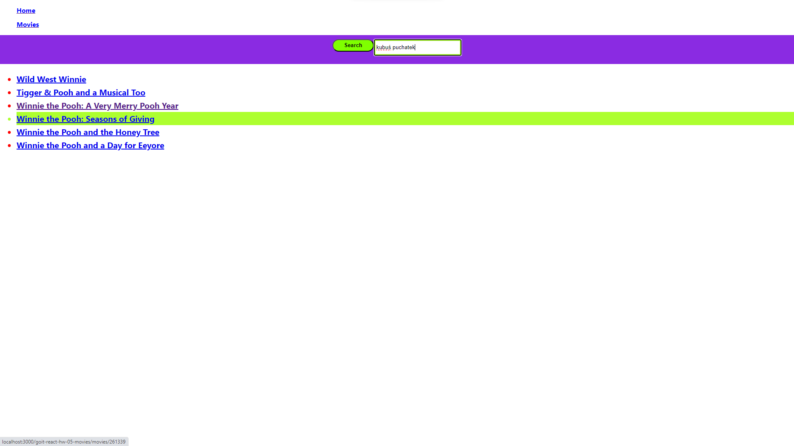

# My name is react project "Movies"

The project provides base routing for video search and storage applications.

The aim of the project was to create an application that allows you to easily
and quickly search for the most popular films for a given day.

Themoviedb.org API was used for the backend. Using this API it was possible to
create: -Lists the most popular videos today to create a collection on the home
page.

- searching for a movie by keyword on the movies page.
- query for full information about the film for the film page.
- request for information about the acting team for the film's website.
- request for reviews for the film's website.

Routes have been created in the application that allow you to smoothly move from
the "Home" page to the "Movies" page, without reloading and going to a
completely new page.

This app consolidates material from your online course. This project was created
with [Create React App] (https://github.com/facebook/create-react-app)

Asynchronous loading of JS code for application routes has also been added,
using React.lazy() and <Suspense>.

 

## Technologies

- "JavaScript"
- "react": "^18.1.0",
- "node": "v18.16.1",
- "react-dom": "^18.1.0", -"axios": "^1.6.2",
- "eslint-config-react-app": "^7.0.1",
- "prop-types": "^15.8.1",
- "react-icons": "^4.12.0",ss
- "react-router-dom": "^6.19.0",
- "react-toastify": "^9.1.3",

## Setup

- git clone - clone the remote repository to your computer locally;
- npm install - create dependencies;
- npm start - run the application, access to it will be at localhost:3000;
